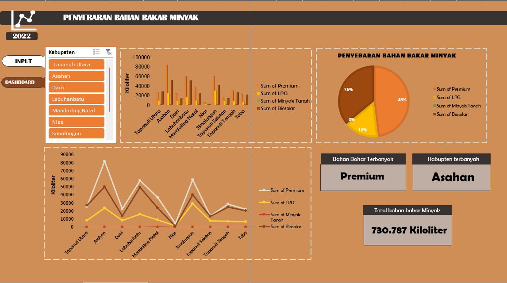

# north-sumatra-fuel-analysis
Analysis of fuel distribution volume by fuel type and regency in North Sumatra Province (2022) using Excel dashboard and data visualization.
# North Sumatra Fuel Analysis

## Project Overview

This project analyzes fuel oil distribution volume by fuel type and regency in North Sumatra Province in 2022.

The objective is to identify fuel distribution patterns and generate insights through Excel dashboard visualization.

---

## Dataset

Source:
BPS North Sumatra Province (Data provided by Pertamina UPMS I Medan)

Period:
2022

Unit:
Kiloliters (KL)

---

## Tools

- Microsoft Excel
- Pivot Table
- Data Visualization
- Dashboard Development

---

## Dashboard Preview

---

## Key Insights

- Analyzed fuel distribution based on fuel type.
- Compared distribution volume across regencies.
- Identified regions with higher fuel demand.
